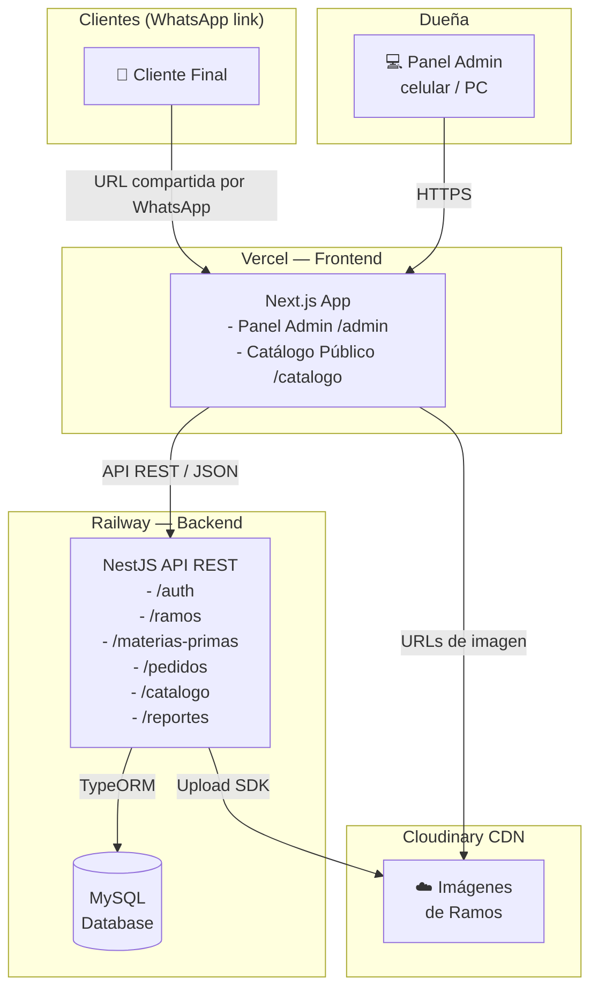

# 4. Diagrama de Alto Nivel

```mermaid
graph TB
    subgraph "Clientes (WhatsApp link)"
        C[📱 Cliente Final]
    end

    subgraph "Dueña"
        A[💻 Panel Admin<br/>celular / PC]
    end

    subgraph "Vercel — Frontend"
        FE[Next.js App<br/>- Panel Admin /admin<br/>- Catálogo Público /catalogo]
    end

    subgraph "Railway — Backend"
        BE[NestJS API REST<br/>- /auth<br/>- /ramos<br/>- /materias-primas<br/>- /pedidos<br/>- /catalogo<br/>- /reportes]
        DB[(MySQL<br/>Database)]
    end

    subgraph "Cloudinary CDN"
        IMG[☁️ Imágenes<br/>de Ramos]
    end

    C -->|URL compartida por WhatsApp| FE
    A -->|HTTPS| FE
    FE -->|API REST / JSON| BE
    BE -->|TypeORM| DB
    BE -->|Upload SDK| IMG
    FE -->|URLs de imagen| IMG
```
